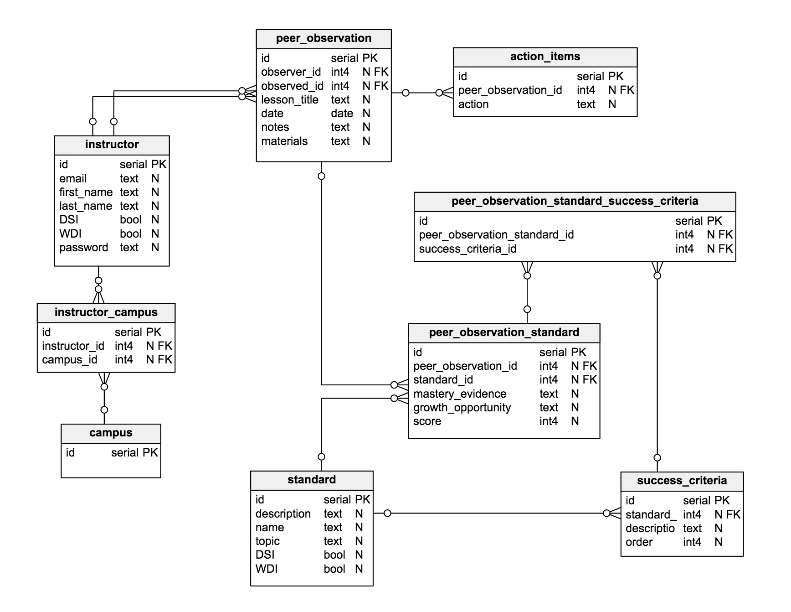

# Peer Observation Database

This repo holds the migrations and seeds for the Peer Observation database.

The client is [here](https://github.com/gSchool/peer_observation_client).

The server is [here](https://github.com/gSchool/peer_observation_server).

## Getting started

The DB should be created, migrated, and seeded before starting the server or client.

`createdb peer_observation`

`knex migrate:latest`

`knex seed:run`

Schema as of commit 1dec603c28611cafd2302c2b8a439c6964d2b126

